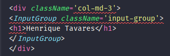

## Heeeeey Coders!!

*__Note: this settings have been teste on VSCode only.__*

So, unless you intend to do a `Hello World` using ReactJS I'm sure you always use a code pattern in your ReactJS projects, right?

So that's where `ESLint` comes in, and `Prettier`.

But before, do you know what these strange names mean?

## What the hell is this ESLint?
---


To summarize, ESLint is a pluggable linter tool for JavaScript and JSX.

- **"But Henrique, what is linter ???? You are not helping like that! 🤬"**


You're right, my dear coder, linter is nothing more than a code watcher, that is, it will analyze what you have typed and suggest improvements to that code. Is it better now?

It's basically the same as underlining we see in Microsoft Word when we write something wrong, for example.


It makes it easy for you to leave your code standardized not only for you, but for your entire team, so the code is standardized and organized not only for you, but for your entire team.

 ### Pre ESLint Code



 ### Post ESLint Code

 

See that the code result is fantastic!

## Prett ... what? Prettier?
---
You thought the conceptual part was over, right?


---

I'll be fast, I promise!

No, Prettier is not a French dish, Prettier is basically a code formatter. It enforces a consistent style by parsing your code and formatting it with your own rules.

So, you can tell that he ESLint and Prettier, although they don't need each other to work, it's quite useful to use both together, right ?!

## Configuring ESLint
---

No more concept, time to code!

 

 ---

> First you add it to your project:

```jsx{}
yarn add eslint -D
```

> So you start it:

```jsx{}
yarn eslint --init
```

**Now will open in your terminal some options, let's go to them:**

> **Step 1:** To begin with is asked how you want to use ESLint, we choose the third option that says: `To check syntax, find problems, and enforce code style`.


> **Step 2:** Now we are asked what kind of module our project uses, and as we already know, ReactJS works with `import / export`, so we select the first option.


> **Step 3:** Well this is easy right? Which framework does our project use? ~~Vue.js~~ React is logical.


> **Step 4:** Here it is asked where our project runs, so we leave it the way it is and select `Browser`.


> **Step 5:** Here questions how we prefer to define the style for our project, we select the first option: `Use a popular style guide`, we will use a popular style, already existing.


> **Step 6:** Let's choose Airbnb's style, in a moment I'll explain why, calm down, and let's move on.


> **Step 7:** In this step we select `JavaScript` so that it creates the ESLint configuration file in` JS` format.


> **Step 8:** Finally he asks if you want to install via npm, unfortunately we have no choice, give a `yes (Y)`.


That's it?


After the installation is complete, it will create a `package-lock.json` file, in the last step when you accept it to install with` npm`, it installs, but creates that file, so ...

> **Passo 9:** Delete the `package-lock.json` file and run the` yarn` command to add the dependencies again, but this time through yarn.

> **Passo 10:** Finally, install `Prettier` dependencies, plus Prettier dependencies with ESLint:

```jsx{}
yarn add prettier eslint-config-prettier eslint-plugin-prettier babel-eslint -D
```

Oh Yeah!!

We're almost there, now just edit the configuration files!

## Settings Files
---

Did you notice that at the root of your project appeared a file called `.eslintrc.js`?


Yeah, it's this little friend that we're going to change, open it, and paste this code:

```jsx{1}
// .eslintrc.js
module.exports = {
  env: {
    browser: true,
    es6: true
  },
  extends: ["airbnb", "prettier", "prettier/react"],
  globals: {
    Atomics: "readonly",
    SharedArrayBuffer: "readonly"
  },
  parser: "babel-eslint",
  parserOptions: {
    ecmaFeatures: {
      jsx: true
    },
    ecmaVersion: 2018,
    sourceType: "module"
  },
  plugins: ["react", "prettier"],
  rules: {
    "prettier/prettier": "error",
    "react/jsx-filename-extension": ["warn", { extensions: [".jsx", ".js"] }],
    "import/prefer-default-export": "off"
  }
}
```

I won't go into much detail, but this code basically sets up for your Prettier and ESLint to work together, that is, in the rules there we are saying that:

  - **"prettier/prettier": "error"** - Prettier will point out any rules it does not find as an error;
  - **"react/jsx-filename-extension": ["warn", { extensions: [".jsx", ".js"] }]** - basically allow us to write `jsx` code in files` js`;
  - **"import/prefer-default-export": "off"** - This rule says that when you have only one `export` inside a file, it is` export default`, I disable it because there are cases, which not necessarily, I want it to be default.

That's it, your ESLint is already set up, ready to use, and to finish, just make a quick setup for Prettier.

Create a file at the root of your project called: `.prettierrc`

Copy the code below into this file:

```jsx{1}
// .prettierrc
{
  "singleQuote": true,
  "trailingComma": "es5"
}
```

This code basically says that we'll use single quotes in the project, and that's all to make Prettier and Style Guide for Airbnb better communicate.

Okay, all set up, if that's all you wanted, we close here, until next time, now for the curious, I will explain, as promised, why I chose the Style Guide of `Airbnb`.

## Airbnb Style Guide
---

The Airbnb style guide is one of the most famous in the world, it is used and supported by large companies, including React himself recommends it. The style of code adopted by them is one of the most acclaimed by the community, so it is the most famous in the world, it is like the English language in the world, ie it is a worldwide standard. And when it comes to the world standard, there is no discussion. I particularly use it only in my projects in ReactJS and React Native, in NodeJS I use another one, I may be bringing a future article about it.

## Finishing
---

I think it was clear then of the importance of a linter in your code, right?! So, although the steps are long to make the settings, it turns out to be a very easy and smooth process!

So coders, that's it! See you!

